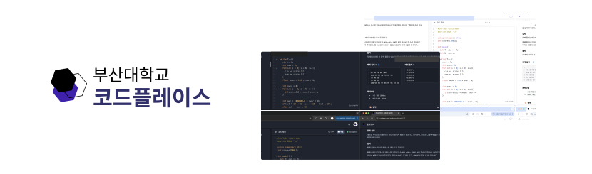

  

# 
PNU Code Place

>  [QingdaoU OJ](https://github.com/QingdaoU/OnlineJudge)를 기반으로, 부산대학교 학생들의 코딩 역량 강화에 도움을 주는 플랫폼 개발
> 
> 개발기간 : 2023.12 ~ 현재
 

## 🔗 배포 주소
> 운영 서버 주소 : https://code.pusan.ac.kr/
> 
> 개발(베타) 서버 주소 : https://copl-dev.site/

 
  
## 👨‍💻 구성원
### BE 개발 인원
<table>
  <tr>
    <td align="center">
      
    </td>
    <td align="center">
      
    </td>
  </tr>
  <tr>
    <td align="center"> <a href="mailto:juniper0917@gmail.com">juniper0917@gmail.com</a> </td>
    <td align="center"> <a href="mailto:boksam1017@gmail.com">boksam1017@gmail.com</a> </td>
  </tr>
  <tr>
    <td align="left" width="350">
      
&nbsp&nbsp&nbsp&nbsp•&nbsp PM, 백엔드 개발 및 배포

    </td>
    <td align="left" width="350">
      
&nbsp&nbsp&nbsp&nbsp•&nbsp 프로젝트 기획 및 백엔드 개발

    </td>
  </tr>
</table>

### FE 개발 인원
<table>
  <tr>
    <td align="center">
      
    </td>
    <td align="center">
      
    </td>
    <td align="center">
      
    </td>
  </tr>
  <tr>
    <td align="center"> <a href="mailto:juniper0917@gmail.com">juniper0917@gmail.com</a> </td>
    <td align="center"> <a href="mailto:ehdwls1638@pusan.ac.kr">ehdwls1638@pusan.ac.kr</a> </td>
    <td align="center"> <a href="mailto:laliddang@gmail.com">laliddang@gmail.com</a> </td>
  </tr>
  <tr>
    <td width="350">
      
&nbsp&nbsp&nbsp&nbsp•&nbsp PM, 프론트/백엔드 기획 및 개발

    </td>
    <td width="350">
      
&nbsp&nbsp&nbsp&nbsp•&nbsp 프론트엔드(Client) 기획 및 개발

    </td>
    <td width="350">
      
&nbsp&nbsp&nbsp&nbsp•&nbsp 프론트엔드(Admin) 기획 및 개발

    </td>
  </tr>
</table>
 

## 🔧 기술 스택
### 🛠 Infra Skill & Tool
   

### 🛠 BE Skill & Tool
  

### 🛠 FE Skill & Tool
     

### 🧩 Communication Tool
   

 

## 💎 라이센스
해당 프로젝트는 [MIT LICENSE](https://opensource.org/license/MIT) 를 따릅니다.
The MIT License (MIT)

Copyright (c) Code Place Developers

Permission is hereby granted, free of charge, to any person obtaining a copy of this software and associated documentation files (the "Software"), to deal in the Software without restriction, including without limitation the rights to use, copy, modify, merge, publish, distribute, sublicense, and/or sell copies of the Software, and to permit persons to whom the Software is furnished to do so, subject to the following conditions:

The above copyright notice and this permission notice shall be included in all copies or substantial portions of the Software.

THE SOFTWARE IS PROVIDED "AS IS", WITHOUT WARRANTY OF ANY KIND, EXPRESS OR IMPLIED, INCLUDING BUT NOT LIMITED TO THE WARRANTIES OF MERCHANTABILITY, FITNESS FOR A PARTICULAR PURPOSE A
